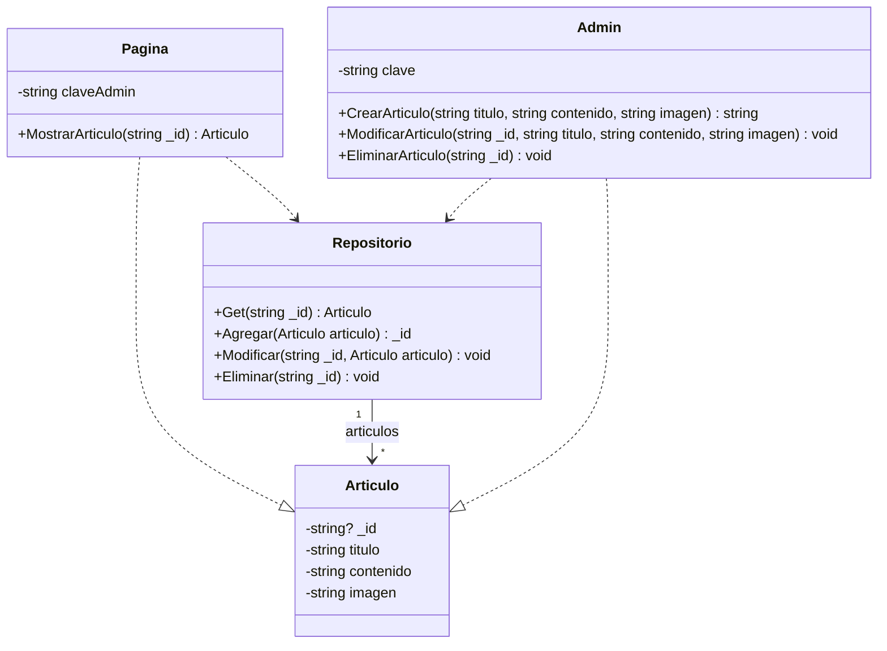

# Diagrama de clases

```mermaid
classDiagram
    class Pagina {
        -string claveAdmin
        +MostrarArticulo(string _id) Articulo
    }

    class Articulo {
        -string? _id
        -string titulo
        -string contenido
        -string imagen
    }

    class Admin {
        -string clave
        +CrearArticulo(string titulo, string contenido, string imagen) string
        +ModificarArticulo(string _id, string titulo, string contenido, string imagen) void
        +EliminarArticulo(string _id) void 
    }

    class Repositorio {
        +Get(string _id) Articulo
        +Agregar(Articulo articulo) _id
        +Modificar(string _id, Articulo articulo) void
        +Eliminar(string _id) void
    }

    Pagina ..> Repositorio
    Pagina ..|> Articulo
    Repositorio "1"-->"*" Articulo : articulos
    Admin ..> Repositorio
    Admin ..|> Articulo

```
